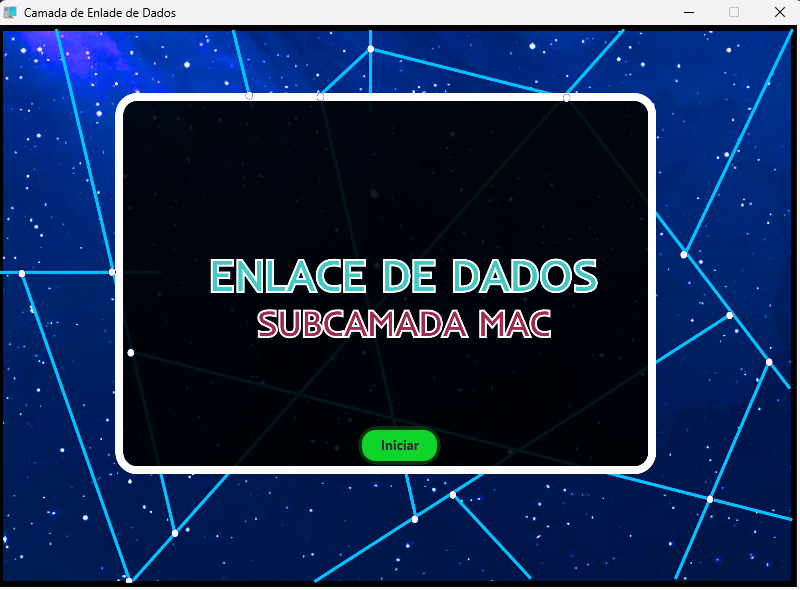
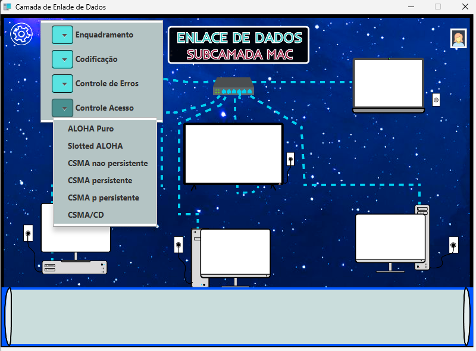
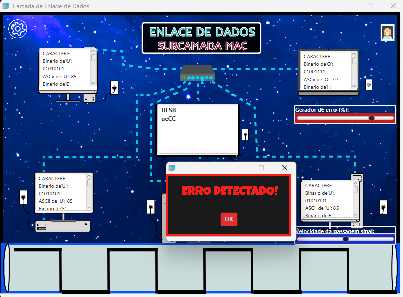
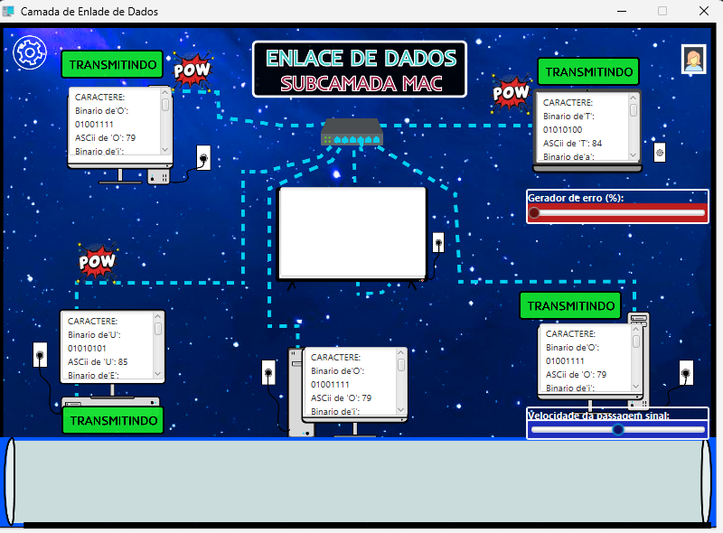
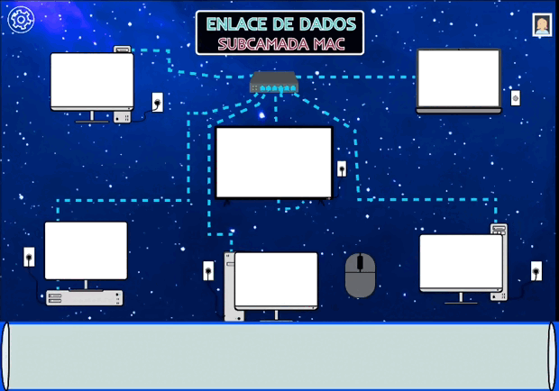

# Sub Camada MAC (Media Access Control)
Projeto realizado para a disciplina de Redes de Computadores 1, na Universidade Estadual do Sudoeste da Bahia (UESB). O software é uma simulação do funcionamento do Acesso ao Meio na Subcamada de Enlace de Dados (Modelo OSI) em uma Rede

## Aplicação 💻🛜
Imagens da Aplicação
<table>
  <tr>
    <td></td>
    <td></td>
  </tr>
  <tr>
    <td></td>
    <td></td>
  </tr>
</table>

## Demonstração
Breve demonstração da aplicação em execução.

## Autor
- https://github.com/Luan-Pinheiro

## 🚀 Sobre mim
Estudantes de Ciência da Computação na Universidade Estadual do Sudoeste da Bahia (UESB).
